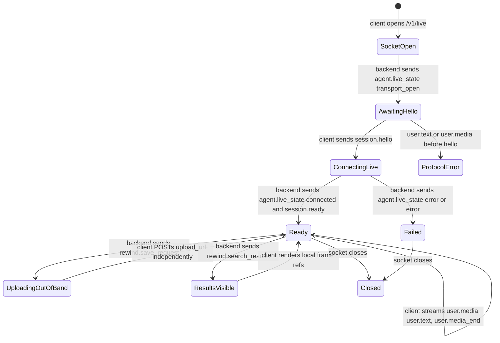

# Rewind Client Protocol

This document is the client implementer contract for the Rewind MVP. It describes the HTTP endpoints, WebSocket lifecycle, message schemas, and out-of-band rewind upload flow used by the web demo and expected from future mobile clients.

The backend owns Gemini Live, function calling, embeddings, Supabase writes, and search ranking. Clients talk only to the Rewind product protocol. Gemini tool calls are backend internals and must not be exposed as a client API.

## Base URL And Identity

Local backend default:

```txt
http://localhost:8787
```

Clients identify a user and device with either query parameters or headers:

```http
x-user-id: 00000000-0000-4000-8000-000000000001
x-device-id: dev-phone
```

Equivalent query parameters are supported:

```txt
?user_id=00000000-0000-4000-8000-000000000001&device_id=dev-phone
```

If neither is provided, the backend uses `DEV_USER_ID` and `DEV_DEVICE_ID` from `.env.backend`. Production clients should always send stable IDs.

Browser clients may call the local backend directly. CORS allows `GET`, `POST`, and `OPTIONS` with `content-type`, `x-user-id`, and `x-device-id`.

## Endpoint Summary

| Method | Path | Purpose |
| --- | --- | --- |
| `GET` | `/health` | Check backend, storage, model, upload, and search configuration. |
| `GET` | `/v1/live` | WebSocket for realtime audio/image/text input and product-level agent output. |
| `GET` | `/v1/rewinds` | List rewinds for the current user. |
| `GET` | `/v1/rewinds/:id` | Fetch one rewind and its frame references. |
| `POST` | `/v1/rewinds/:id/commit` | Out-of-band upload that commits frames for a pending rewind. |
| `POST` | `/v1/rewinds/search` | Manual semantic/database search using the same path as Live search. |

REST errors use:

```json
{ "error": "Human readable error" }
```

WebSocket errors use:

```json
{ "type": "error", "error": "Human readable error", "details": {} }
```

## Health

```http
GET /health
```

The response is safe for clients and debug UIs. It does not include secrets.

```json
{
  "ok": true,
  "service": "rewind-backend",
  "storage": { "repository": "supabase-local" },
  "realtime": {
    "websocket_path": "/v1/live",
    "live_model_name": "gemini-2.5-flash-native-audio-preview-12-2025"
  },
  "embeddings": {
    "provider": "gemini",
    "mode": "text_only",
    "text_model": "gemini-embedding-2",
    "image_embedding_model": "gemini-embedding-2",
    "dimension": 768,
    "max_embedded_frames_per_rewind": 12
  },
  "uploads": {
    "rewind_commit_path": "/v1/rewinds/:event_id/commit",
    "max_body_bytes": 15728640
  },
  "search": {
    "rewind_search_path": "/v1/rewinds/search"
  }
}
```

Clients should use this to show backend connectivity and to decide whether frame image upload is useful. If `embeddings.mode` is `text_only`, clients should not upload raw frame images.

## Live WebSocket

Connect to:

```txt
ws://localhost:8787/v1/live?user_id=...&device_id=...
```

The live socket is only for low-latency interaction:

- Client to backend: `session.hello`, `user.text`, `user.media`, `user.media_end`.
- Backend to client: `session.ready`, `agent.live_state`, `agent.message`, `agent.media`, `rewind.save_request`, `rewind.search_results`, `error`.
- Rewind frame uploads are never sent over this socket. They use `POST /v1/rewinds/:id/commit`.

### State Machine



Rules:

1. The backend immediately sends `agent.live_state` with `state: "transport_open"` and `payload.handshake_required: true`.
2. The client must send exactly one `session.hello` before any media or text.
3. The backend validates the buffer declaration, starts Gemini Live, creates an agent session, then sends `session.ready`.
4. The client should not start audio/image streaming until `session.ready`.
5. `rewind.save_request` creates a pending event on the backend first, then asks the client to upload the selected local frame window out-of-band.
6. The live socket must continue while the out-of-band upload runs. Do not block realtime media on upload completion.
7. Search results contain `device_frame_uuid` references. The client resolves those to local cached images or videos.

### Client Handshake

First client message after WebSocket open:

```json
{
  "type": "session.hello",
  "protocol_version": 1,
  "timestamp": "2026-06-06T15:30:00.000Z",
  "device": {
    "id": "dev-phone",
    "kind": "ios",
    "label": "Riccardo phone"
  },
  "buffers": {
    "rewind": {
      "duration_ms": 60000,
      "frame_interval_ms": 1000,
      "max_frames": 60
    },
    "realtime": {
      "image_interval_ms": 1000,
      "audio_chunk_ms": 250,
      "audio_sample_rate_hz": 16000
    }
  },
  "capabilities": {
    "out_of_band_rewind_upload": true,
    "local_frame_store": true,
    "image_upload_for_embedding": true,
    "manual_search": true
  }
}
```

Validation limits:

| Field | Range |
| --- | --- |
| `protocol_version` | Must be `1`. |
| `buffers.rewind.duration_ms` | `1` to `300000`. |
| `buffers.rewind.frame_interval_ms` | Optional, `1` to `60000`. |
| `buffers.rewind.max_frames` | Optional, `1` to `10000`. |
| `buffers.realtime.image_interval_ms` | Optional, `1` to `60000`. |
| `buffers.realtime.audio_chunk_ms` | Optional, `1` to `10000`. |
| `buffers.realtime.audio_sample_rate_hz` | Optional, `1` to `192000`. |

The backend uses `buffers.rewind.duration_ms` to set the maximum `rewind_duration_seconds` that Gemini Live may request. The prompt asks the model to choose the smallest useful replay window rather than always using the full buffer.

### Session Ready

```json
{
  "type": "session.ready",
  "session_id": "live-session-uuid",
  "user_id": "00000000-0000-4000-8000-000000000001",
  "device_id": "dev-phone",
  "max_rewind_duration_seconds": 60
}
```

After this message, the client may stream audio, images, video frames, or text.

### Client Input Messages

Text input:

```json
{ "type": "user.text", "text": "where is my pen?" }
```

Media input:

```json
{
  "type": "user.media",
  "modality": "audio",
  "mime_type": "audio/pcm;rate=16000",
  "data": "<base64 bytes>",
  "seq": 42,
  "timestamp": "2026-06-06T15:30:00.000Z"
}
```

End of one media stream:

```json
{ "type": "user.media_end", "modality": "audio" }
```

Recommended MVP media settings:

| Stream | Recommendation | Reason |
| --- | --- | --- |
| Audio | 16 kHz PCM, 250 ms chunks | Low latency and cheap enough for Live speech understanding. |
| Realtime images | 384 px max edge JPEG, 1 FPS by default | Gives visual context without burning tokens too quickly. |
| Local rewind buffer | 1 FPS frame cache, 30 to 60 seconds | Enough temporal coverage for object/location memories. |

The agent loop does not care how frequently the client captures frames. It forwards whatever `user.media` messages arrive. Cost and visual recall quality are controlled by the client capture cadence and by whether frame image embeddings are enabled server-side.

### Backend Output Messages

Agent state:

```json
{
  "type": "agent.live_state",
  "state": "connected",
  "payload": { "setup_complete": true }
}
```

Valid states are `transport_open`, `connecting`, `connected`, `closed`, and `error`.

Agent text or debug message:

```json
{
  "type": "agent.message",
  "text": "Search returned 2 rewind results."
}
```

Agent media:

```json
{
  "type": "agent.media",
  "modality": "text",
  "text": "I found it on your desk."
}
```

`agent.media.modality` can be `text` or `audio`. Audio includes `mime_type` and base64 `data`.

## Creating A Rewind

When Gemini Live decides the user asked to remember something, the backend creates a pending event and sends:

```json
{
  "type": "rewind.save_request",
  "request_id": "gemini-function-call-id",
  "event_id": "rewind-event-uuid",
  "upload_url": "/v1/rewinds/rewind-event-uuid/commit",
  "title": "Pen location",
  "description": "User asked to remember where the pen was left.",
  "rewind_duration_seconds": 8,
  "include_frame_images": false,
  "frame_embedding_mode": "text_only"
}
```

Client behavior:

1. Keep the live socket running.
2. Select the last `rewind_duration_seconds` from the local frame buffer.
3. Upload the selected frame references to `upload_url`.
4. Include raw frame bytes only when `include_frame_images` is `true`.

The pending event already contains the model-inferred title, description, entities, location hint, and event embedding. The commit attaches frame references, timestamps, optional location, and optional frame embeddings.

### Commit Upload

```http
POST /v1/rewinds/:event_id/commit
content-type: application/json
x-user-id: ...
x-device-id: ...
```

Payload:

```json
{
  "event_id": "rewind-event-uuid",
  "local_asset_id": "client-local-asset-id",
  "thumbnail_frame_uuid": "client-frame-uuid",
  "started_at": "2026-06-06T15:29:52.000Z",
  "ended_at": "2026-06-06T15:30:00.000Z",
  "location": {
    "latitude": 45.4642,
    "longitude": 9.19,
    "location_hint": "desk"
  },
  "frames": [
    {
      "device_frame_uuid": "client-frame-uuid",
      "local_asset_id": "client-local-asset-id",
      "captured_at": "2026-06-06T15:29:59.000Z",
      "offset_ms": 7000
    }
  ],
  "metadata": {
    "rewind_duration_seconds": 8,
    "frame_embedding_mode": "text_only"
  }
}
```

When `include_frame_images` is `true`, each selected frame may also include:

```json
{
  "image_base64": "<base64 jpeg bytes>",
  "mime_type": "image/jpeg"
}
```

Raw images are used transiently for Gemini image embeddings and are not stored in Supabase. In `text_only` mode, omit `image_base64` and `mime_type`.

Successful commit response:

```json
{
  "event": {
    "id": "rewind-event-uuid",
    "status": "committed",
    "title": "Pen location",
    "description": "User left the pen on the desk.",
    "entities": ["pen", "desk"],
    "location_hint": "desk"
  },
  "frames": [
    {
      "id": "stored-frame-row-uuid",
      "device_frame_uuid": "client-frame-uuid",
      "captured_at": "2026-06-06T15:29:59.000Z",
      "offset_ms": 7000
    }
  ]
}
```

Embeddings are never returned to clients.

## Searching Rewinds

Live search and manual HTTP search use the same backend code path, embeddings, Supabase RPC, ranking, and response shape.

Manual search:

```http
POST /v1/rewinds/search
content-type: application/json
x-user-id: ...
```

Payload:

```json
{
  "query": "where is my pen?",
  "limit": 10,
  "entities": ["pen"],
  "location_hint": "desk",
  "time_range": {
    "started_after": "2026-06-06T00:00:00.000Z",
    "ended_before": "2026-06-07T00:00:00.000Z"
  },
  "context": {
    "status": ["committed"],
    "database_filters": {}
  }
}
```

Required:

| Field | Notes |
| --- | --- |
| `query` | Required, 1 to 1000 characters. |

Optional:

| Field | Notes |
| --- | --- |
| `limit` | Defaults to `10`, maximum `20` through the HTTP/tool schema. |
| `entities` | Narrows matches to events with overlapping extracted entities. |
| `location_hint` | Narrows by fuzzy location hint. |
| `time_range.started_after` | ISO datetime lower bound. |
| `time_range.ended_before` | ISO datetime upper bound. |
| `context` | Alternate container for the same filters, useful for future clients. |

HTTP response. The live socket emits the same object with an added top-level `"type": "rewind.search_results"` field.

```json
{
  "query": "where is my pen?",
  "filters": {
    "time_range": {
      "started_after": "2026-06-06T00:00:00.000Z"
    },
    "entities": ["pen"],
    "location_hint": "desk"
  },
  "results": [
    {
      "event_id": "rewind-event-uuid",
      "title": "Pen location",
      "description": "User left the pen on the desk.",
      "entities": ["pen", "desk"],
      "location_hint": "desk",
      "started_at": "2026-06-06T15:29:52.000Z",
      "ended_at": "2026-06-06T15:30:00.000Z",
      "score": {
        "similarity": 0.82,
        "event_similarity": 0.82,
        "frame_similarity": null,
        "text_rank": 0.6
      },
      "frame_refs": [
        {
          "frame_id": "stored-frame-row-uuid",
          "device_frame_uuid": "client-frame-uuid",
          "captured_at": "2026-06-06T15:29:59.000Z",
          "offset_ms": 7000
        }
      ]
    }
  ]
}
```

### Search Ranking

The Supabase RPC searches committed and pending events for the current user. It combines:

- Event embedding similarity from title, description, entities, and location hint.
- Optional frame image embedding similarity when `EMBEDDING_MODE=text_and_image`.
- Full-text rank over title, entities, description, and location hint.
- Metadata filters for entities, location, status, and time range.
- Recency as a secondary tie-breaker after semantic/text relevance.

Postgres uses `pgvector` HNSW indexes for event and frame vectors, a GIN index for full-text search, and focused B-tree/GIN indexes for user, status, time, device, and entity filters.

## Listing And Fetching Rewinds

```http
GET /v1/rewinds
```

Returns:

```json
{
  "results": [
    {
      "id": "rewind-event-uuid",
      "status": "committed",
      "title": "Pen location",
      "description": "User left the pen on the desk.",
      "entities": ["pen", "desk"],
      "frames": []
    }
  ]
}
```

```http
GET /v1/rewinds/:id
```

Returns:

```json
{
  "event": {
    "id": "rewind-event-uuid",
    "status": "committed",
    "title": "Pen location",
    "description": "User left the pen on the desk.",
    "entities": ["pen", "desk"]
  },
  "frames": [
    {
      "id": "stored-frame-row-uuid",
      "device_frame_uuid": "client-frame-uuid",
      "captured_at": "2026-06-06T15:29:59.000Z",
      "offset_ms": 7000
    }
  ]
}
```

List/detail responses never include vector values or raw image bytes.

## Client Implementation Checklist

1. Keep a local rolling frame buffer keyed by stable `device_frame_uuid`.
2. Connect to `/v1/live` with stable user/device identity.
3. Send `session.hello` immediately and wait for `session.ready`.
4. Stream realtime audio and optional images through `user.media`.
5. On `rewind.save_request`, upload the requested frame window to `upload_url` over HTTP without blocking the live socket.
6. On `rewind.search_results`, render result metadata and resolve `frame_refs[].device_frame_uuid` against the local frame cache.
7. Use `POST /v1/rewinds/search` for manual search screens; it returns the same result shape as Live search.
8. Treat embeddings, Gemini messages, and Supabase implementation details as backend internals.
